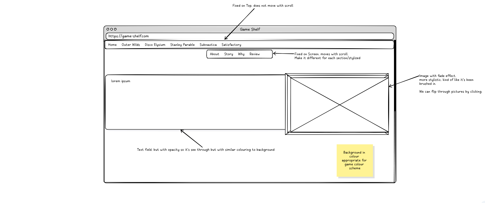
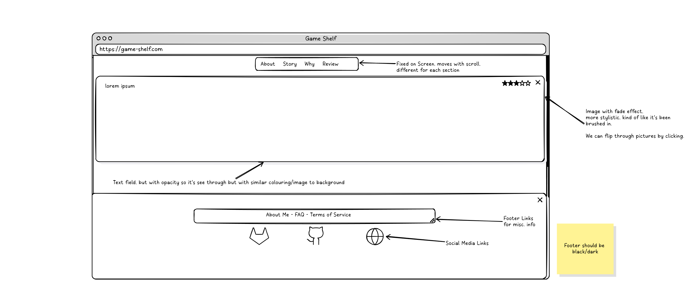

# Project Planning

Before starting the development of **Game Shelf**, I used the tool **Frame0** to create a clear wireframe and plan the structure of the website.  
The goal was to design a responsive and easy-to-navigate layout where users could seamlessly explore different game sections.

Below is one of the initial sketches I created for the project:

Basically, I just went with a general outline for how the top and bottom part of the page should look.

As we can see here, there are some details that ended up different. Especially, the image carousels/being able to flip
between pictures was never implemented.

The wireframe outlines the key components of the site:

- **Fixed top navigation bar** that stays visible regardless of scrolling.
- **Floating menu** that moves along as the user scrolls, allowing quick access to subpages (About, Story, Why, Review).
- **Text and image sections** that complement each other, with a focus on readability and user experience.
- **Semi-transparent elements** to create a clean and cohesive design that blends with the background.

The planning phase helped me organize the project from the start and made it easier to build the HTML and CSS code in a structured way.  
By using a wireframe, I could concentrate on layout and user flow before diving into detailed design and functionality.

---

# Technologies and Tools Used

- **HTML** — For the structure and content of the pages.
- **CSS** — For styling, layout, and responsiveness.
- **JavaScript** — For basic interactivity like modals and image enlargements.
- **Frame0** — For wireframe and layout planning.
- **Visual Studio Code** — As the main development environment.
- **Git** — For version control during the development process.

---

# Goal of the Project

This project was created as part of a school assignment, with the purpose of practicing basic front-end skills — focusing on **HTML**, **CSS**, and a small amount of **JavaScript**.  
Rather than building a generic portfolio, I chose to make something personal:  
A tribute to games that I love!

Each section was a chance to practice:

- Layout building
- Design consistency
- Responsive adjustments
- Small-scale JavaScript interactions
- Good file structure and planning habits

Everything was built from scratch — no frameworks were used.

Hope you enjoy it! 🚀
